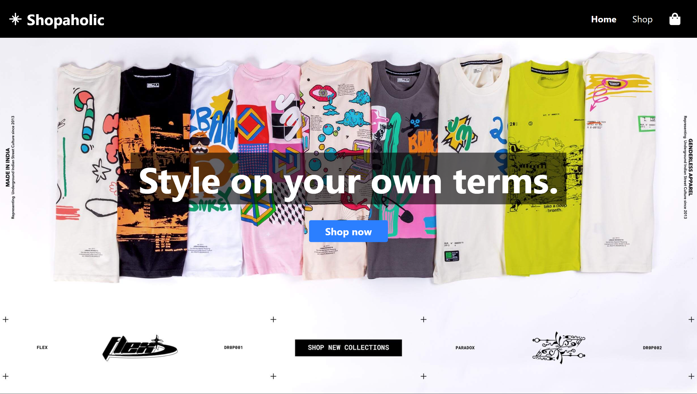

<p align="center">
  
</p>


# Shopaholic

* Shopaholic is your ultimate online destination for stylish fashion and trendy accessories. Explore a wide range of clothing for men and women, carefully curated to suit every style and occasion. Beyond fashion, discover our exclusive collection of elegant rings and the latest gadgets to complement your lifestyle. Whether you're refreshing your wardrobe or searching for the perfect gift, Shopaholic offers quality, variety, and convenience all in one place.
* LIVE: <a href="https://shopaholic-sether31.vercel.app/">Shopaholic Preview</a>

## How It Works

1. **Browse Products**
  - Explore a wide range of men’s and women’s clothing, rings, and gadgets.
2. **Select Items**
  - Choose your favorite products and add them to your shopping cart.
3. **Checkout**
  - Review your cart, provide shipping details, and complete your purchase with secure payment options.
4. **Dynamic Searching**
  - Quickly find products using real-time search.

## Features
1. **Browse Products** 
  - View a curated collection of men’s and women’s clothing, rings, and gadgets.
2. **Dynamic Search** 
  - Quickly find products with instant search.
3. **Add to Cart** 
  - Select products and add them to a shopping cart stored locally (using browser storage).
4. **Cart Management** 
   - Edit quantities or remove items directly in the cart.
5. **Responsive Design** 
  - Optimized for seamless browsing on both desktop and mobile devices.

## Installation

#### 1. **Clone the repository:**
```cmd
git clone https://github.com/sether31/Shopaholic.git
```
#### 2. **Install dependencies**
```cmd
npm install
```

## Technologies Used
#### Frontend
  + HTML
  + Tailwind CSS (CSS Framework)
  + React with vite
  + NPM.
